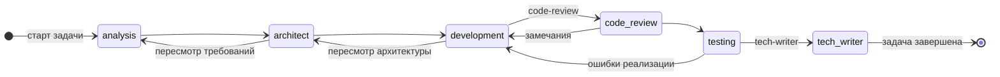
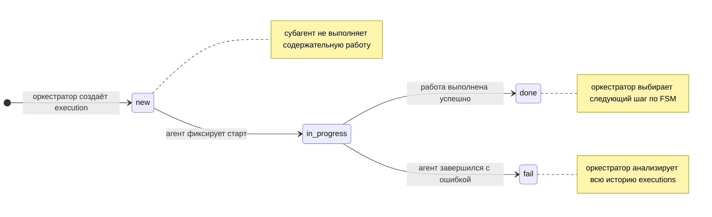
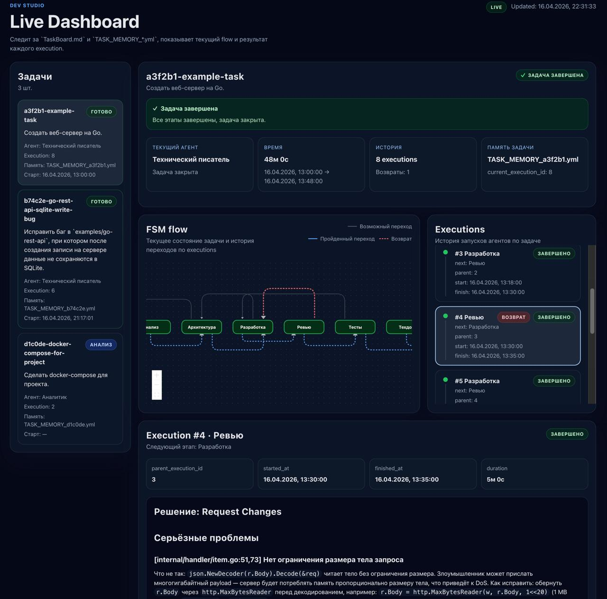

# Cursor Agent Orchestrator

## О проекте

Мультиагентная система оркестрации для Cursor: разработчик, тестировщик, аналитик, архитектор, код-ревьювер и технический писатель работают в едином координированном процессе (SDLC). Оркестратор ведёт задачи по конечному автомату (FSM), создаёт execution’ы с типом агента и запускает соответствующих субагентов.

Протокол данных, сущности `Task` / `Execution` и правила маршрутизации описаны в [`task-protocol.md`](task-protocol.md). Поведение ролей зафиксировано в skills в каталоге [`.cursor/skills/`](.cursor/skills/).

## Архитектура: каждый скилл — отдельный субагент

Ключевой принцип системы: **каждая роль (скилл) запускается как субагент** внутри Cursor. **Субагент** здесь — это встроенная в Cursor возможность делегировать этап отдельному агентскому запуску из чата оркестратора (отдельный контекст и инструкции из соответствующего skill). Оркестратор не выполняет работу сам — он создаёт `execution` с нужным `agent_type` и передаёт управление специализированному субагенту. Тот завершает свою часть, фиксирует результат в `output_data`, и управление возвращается оркестратору для принятия следующего шага по FSM.

### Преимущества изолированного запуска субагентов

**Чистый контекст.** Каждый субагент стартует с пустым контекстным окном, загружая только то, что нужно для его роли. Аналитик не «видит» код, разработчик не засорён историей требований — модель работает точнее без лишнего шума.

**Специализация.** Системный промпт, инструменты и стратегия рассуждений подбираются под конкретную роль. Архитектор мыслит схемами и компонентами, тестировщик — граничными случаями, ревьювер — рисками и стилем кода.

**Независимость от сбоев.** Ошибка или зависание одного субагента не обрушивает весь процесс. Оркестратор видит статус каждого `execution` и может перезапустить только упавший шаг.

**Повторяемость и отладка.** Любой `execution` можно воспроизвести изолированно: взять его `input_data` из файла памяти и запустить того же субагента заново. Не нужно прогонять весь цикл с нуля.

**Параллельность.** Несколько задач могут проходить разные этапы одновременно: пока одна задача находится на ревью, другая — в разработке. Субагенты не блокируют друг друга.

**Трассируемость.** Каждый субагент фиксирует свой `output_data` в `memory/TASK_MEMORY_*.yml`. Это создаёт полный audit trail: кто что решил, на каком этапе и почему.

### FSM переходов между этапами

Оркестратор выбирает следующий `agent_type` по таблице допустимых переходов — только после `status: done` у текущего execution. После `fail` оркестратор анализирует всю историю и выбирает шаг свободно.



### Жизненный цикл Execution

Каждый запуск агента — отдельная запись `Execution` в памяти задачи. Статус меняется линейно:



## Запуск оркестратора (точка входа)

Точка входа в процесс — **скилл оркестратора** ([`.cursor/skills/orchestrator/SKILL.md`](.cursor/skills/orchestrator/SKILL.md)): он читает доску задач, создаёт execution’ы и координирует субагентов по FSM.

Запуск выполняется **в чате Cursor**. Откройте чат с агентом, у которого доступен этот репозиторий и skills, и отправьте команду (вместо `<описание>` — текст задачи для доски):

```text
/orchestrator создай задачу на доске <описание> и начни выполнять
```

После этого оркестратор должен создать задачу на доске и начать выполнение согласно протоколу.

## Дешборд

В каталоге [`dashboard/`](dashboard/) лежит веб-приложение, которое **визуализирует работу агентов в реальном времени**: доска задач, таймлайн execution’ов, граф FSM и «комната» с агентами. Бэкенд следит за файлами в [`memory/`](memory/) (`memory/TaskBoard.md`, `memory/TASK_MEMORY_*.yml`) и рассылает обновления клиентам через SSE.



### Запуск

Требуются Node.js и npm.

```bash
cd dashboard
npm install
npm run dev
```

Поднимаются Vite (клиент) и dev-сервер парсера/стриминга. Порт API по умолчанию задаётся переменной `PORT` (если не указана — **3001**). Бэкенд по умолчанию читает состояние из **`<корень_репозитория>/memory`**; при другом расположении укажите абсолютный путь к каталогу с доской и YAML в `DASHBOARD_DATA_DIR` или устаревший алиас `DEV_STUDIO_DATA_DIR`. Подробности по стеку и линтингу — в [`dashboard/README.md`](dashboard/README.md).

## Структура репозитория (кратко)

| Путь | Назначение |
| --- | --- |
| `task-protocol.md` | Форматы данных и правила для агентов |
| `.cursor/skills/` | Инструкции для оркестратора и субагентов |
| `memory/` | Доска и YAML-память: `memory/TaskBoard.md`, `memory/TASK_MEMORY_<hex>.yml` |
| `dashboard/` | UI + сервер live-обновлений для мониторинга |

В репозитории присутствуют примеры реальных прогонов: [`memory/TaskBoard.md`](memory/TaskBoard.md) с завершёнными задачами и файлы памяти [`memory/TASK_MEMORY_a3f2b1.yml`](memory/TASK_MEMORY_a3f2b1.yml), [`memory/TASK_MEMORY_b74c2e.yml`](memory/TASK_MEMORY_b74c2e.yml), [`memory/TASK_MEMORY_c7e4b2.yml`](memory/TASK_MEMORY_c7e4b2.yml) — по ним удобно изучить структуру данных и историю execution'ов.
